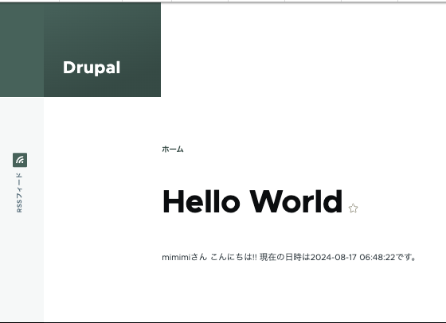

## 概要
・以前作成したShow_current_time_moduleを改良し、/helloのpathにアクセスするとユーザー名と現在時刻を表示するカスタムモジュールを作成した。<br>
・具体的には、まずユーザー名を取得するサービスと現在時刻を取得するサービスの合計二つのカスタムサービスを作成した。そしてその二つのカスタムサービスをカスタムコントローラーに対して、コンストラクタインジェクションした。

## 工夫した点
・Show_current_time_moduleでの問題点であるコントローラーでビジネスロジックを書いているという問題をカスタムサービスをAutowireを使ってDIすることで解決した。また、気軽に呼べることにより、どこでカスタムサービスが呼ばれているのかわからなくなり、保守性が下がるので、$hello_world = \Drupal::service('hello_world.my_module_service')->getHelloWorld();のようにサービスロケーターを使ってカスタムサービスを呼ぶことも禁止した。

・カスタムサービスの手動でのテストとして drush php を利用した。具体的には drush php $hello_world = \Drupal::service('hello_world.my_module_service')->getHelloWorld() といった形だ。簡単にテストできるため、非常に便利であった。

・デバッグにはdevel の kintを利用した。

## 詰まった点と解決
・Show_current_time_moduleではカスタムサービスが呼べなかったため、断念したが、解決することができた。それは
```
$ composer dump-autoload
```
を利用することであった。ディレクトリ構成を変更した場合などにdrush cr とともに実行する必要があった。また、これをきっかけに、このような問題で詰まらないようにpsr-4の仕様や、autoloadの仕組みについて詳しく調査できたのでよかった。

・DrupalAPIの呼び出し方がようやくわかった。DrupalAPIを呼び出す時の形式は大きく分けて３種類あり、①Drupalファサード ②サービスロケーター ③DI(コンストラクタ,セッターetc)であるようだ。(※①のDrupalファサードは\Drupal::hoge()のようにいきなり呼び出すことのできる形式をLaravelのファサードになぞらえて、私が仮称している)②のサービスロケーターは上述のとおり保守性が下がるので drush php 内でのケース以外では、使用は推奨されていない。<br>
・また、time()やcurrentUser(),entityQuery()がDrupal::hoge()のファサード形式で呼べるのに対して、DateFormatterなどはその形式で呼べず、サービスロケーターやDIする必要があるのか疑問であった。調べたところ、Drupal APIの [class Drupal](https://api.drupal.org/api/drupal/core%21lib%21Drupal.php/class/Drupal/11.x)に記載されているAPIはファサードとして呼べるということが判明した。そのソースはcore/lib/Drupal/phpに載っておりgetContainerしていることがわかる。

### 実行時画面
